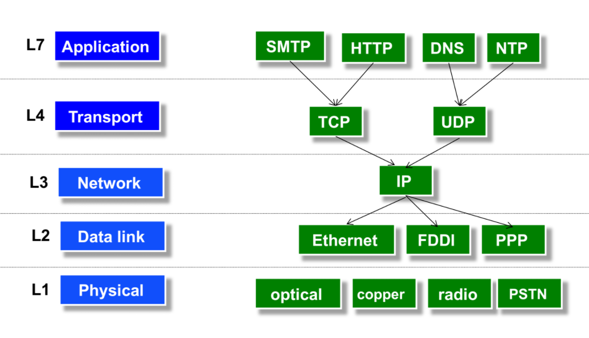
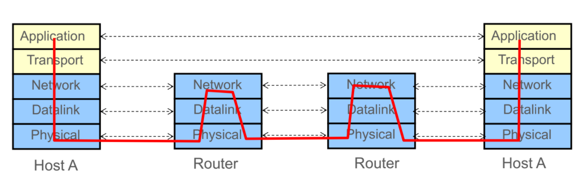

_Self study notes taken from lecture slides_

# CS 168: Introduction to the Internet: Architecture and Protocols
*(Spring 2020 coursework)*
*Instructor: Sylvia Ratnasamy, Murphy McCauley*

1. Internet
2. Protocols
3. Architecture

## Internet

### L2: How the Internet Works

The Internet transfers data between endhosts:

Communication between a pair of endpoints involve sending **packets** of data:
- Packets are chunk of bits with headers
- Header contains destination address and name

Packets are transmitted from endhosts via **links**:
- Bandwidth: Number of bits transmitted per unit time
- Propagation delay: time it takes to travel along the link

Time taken to send packets: Transmission delay, propagation delay, queue delay.

Network resources are shared between end hosts. They are **statistically multiplexed**.
- Demands are combined to share resources efficiently anad hope that peak rates don't occur at same time
- Based on the premise that peak of aggregate load is << aggregate of peak loads

---
### L3: Architectural Principles

Two approaches to sharing network resources:
1. Reservations/**circuit switching**: End-hosts reserve bandwidth when needed
2. On demand/**packet switching**: Data packets are sent as they emerge. Resources given out on packet by packet basis.

Pros for circuit switching:
- More predictable performance (reserved bandwidth)
- No queues
- Used by telephone network

Pros for packet switching:
- Better efficiency
- Faster startup
- Easier recover from failure
- Simpler implementation 
- Used by Internet
 
#### Network System Modularity

Protocol
> agreement between parties on **how to communicate**. Deines the syntax of communication. Exists at hardware and software level.

L2 local delivery of packets. L3 global delivery of packets.

Notice there is only one IP layer! 

Lower three layers implemented everywhere. Top two layers implemented only at hosts. 

Operating System (OS) supports **logical ports**:
- place where app connects to OS network stack

Switches/routers have **physical ports**
- place where links connect to switches

Socket 
> an OS mechanism that **connects app processes to the network** stack

When an app wants to access to the network, it opens a socket which is associated with a port. 

The **port number** is used by the OS to **direct incoming packets to its associated socket**.

### L4: Design Goals

Packet header must include destination **host address and port number**.

Communication goes down to physical network and up to relevant layer.

Where to enforce reliability?

Everyone agrees that reliability should be **implemented at the endhosts**, we cannot make each step reliable **nor can we assume network is reliable**.

However, in some cases (e.g. network link with has high loss rate), it helps to implement reliability in network.

Three interpretations of End to End principles (E2E):
- Only-if-sufficient - don't implement reliability at lower levels of system
- Only-if-necessary - make network layer minimal
- Only-if-useful - implement reliability at lower level as performance enhancement

Internet design goals:
- Build something that works
- Connect existing networks
- Support multiple types of applications
- Robust in face of failures
- Accommodate a variety of networks
- Allow distributed management of resources
- Easy end host attachment
- Allow resource accountability

If the goal of Internet is to support many many applications, and applications have different requirements, how does the Internet support them all? By building the lowest common denominator service (architected for flexibility) 

### Routers 

Switches do what routers do but *in a single network*. 
- Switch don't participate in global delivery **between* networks
- Switch almost always mean router.

Distance-Vector key points:
- Scalable 
- Distributed - routers communicate with neighbors to compute routes 
- Minimizes Distance - avoids loops and minimize price, latency

Two components of distance-vector:
- Protocol - each router advertises routes in its tables to neighbors (periodically and whenever its table changes).
- Algorithm - on receiving an advertisement, a router may update its own table

## Protocols

## Architecture

